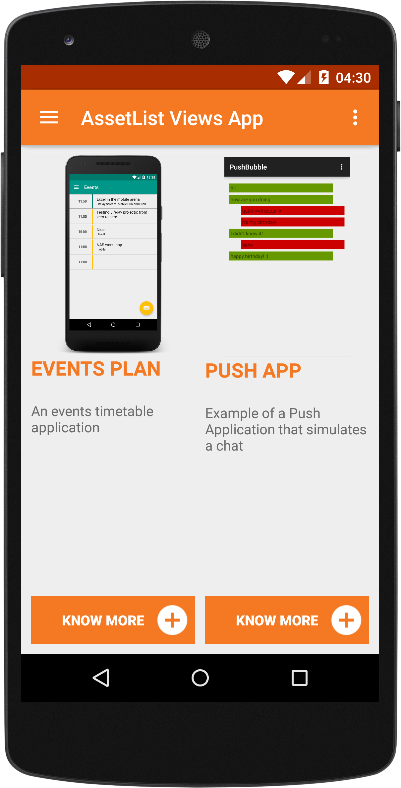
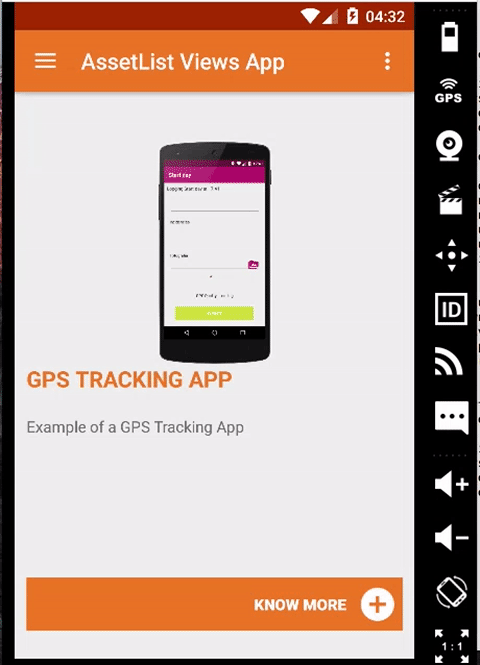

# Asset List Views examples

## Introduction

This example Android app customizes [Liferay Screens](https://github.com/liferay/liferay-screens/) to show a AssetList with 3 different custom views, a normal list with a custom adapter, a grid and a slideshow.

## Screenshots

