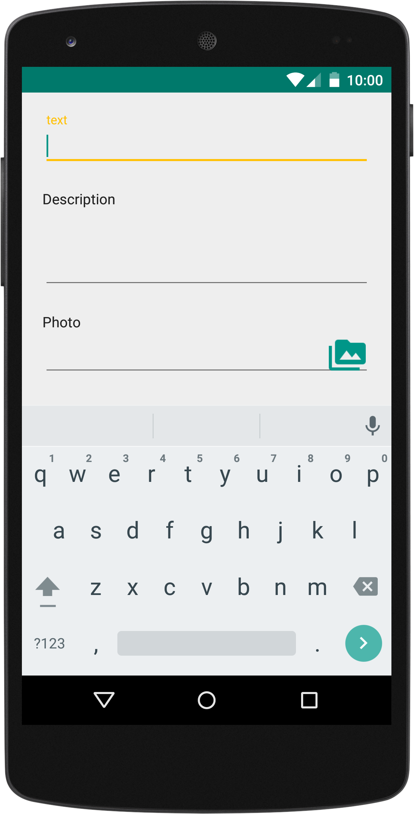
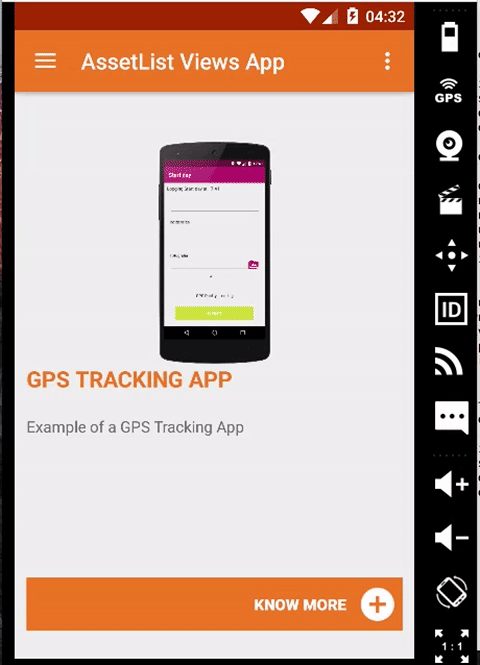
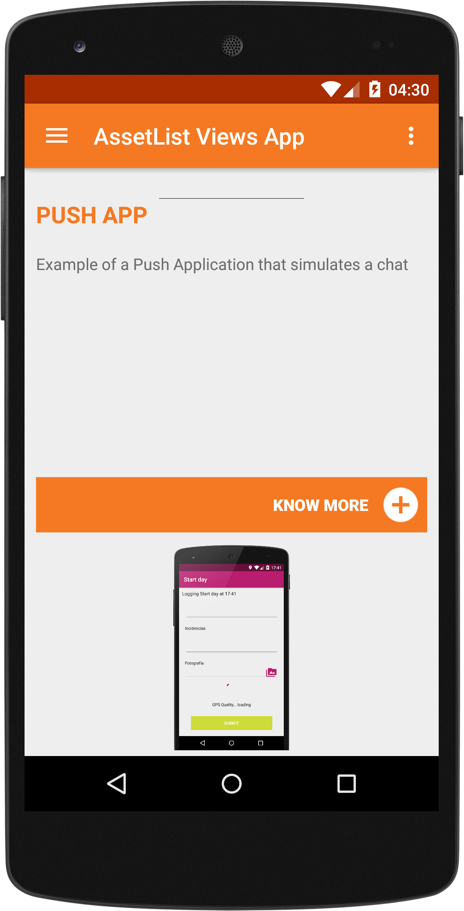
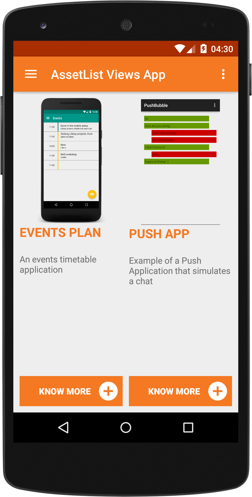

# ScreensDemos
Liferay Screens Demo Projects

* **EzentisTrackingApp**

	
	
	

	
	An example project with **GPS tracking and map rendering** developed in 6 hours. You need to supply a valid google maps key to be able to show the maps.
	
* **LoginByCookie**: an example on how to get a valid login cookie and do authenticated requests with that cookie

* **PushChatBubble**: example chat app with **push messages** and bubbles to render them

	
	
	This example Android app uses [Liferay Screens](https://github.com/liferay/liferay-screens/), the [Push Notification plugin for Android](https://github.com/brunofarache/liferay-push-android) and a [portlet](https://github.com/liferay/liferay-plugins/tree/master/portlets/push-notifications-portlet) to receive push notifications. Checkout this [video](https://www.youtube.com/watch?v=4LjutX0dcRw) to see how to create the application from scratch.
	
* **Liferay Events**

	Example application for the Liferay Developer Conference 2015, showing a calendar view (agenda), list of sponsors, allows to add talks, login, user portrait and a list of blogs
	
	
	
	
	
* **PushWithDDLHook**: a Liferay 6.2 hook illustrating how to send a push notification when a new DDL record is added.

* **WorkshopExampleApp**: an example application developed in 20 minutes illustrating how to integrate push notifications, ddl forms, cache and login.

* **AssetListViews**: an example app with several custom views, a list with a custom adapter, a grid and a slideshow.

