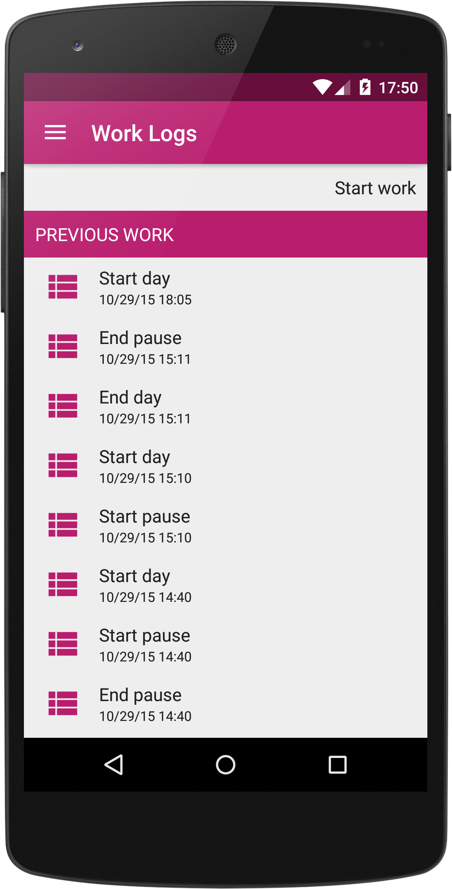

# ScreensDemos
Liferay Screens Demo Projects

* **EzentisTrackingApp**

	
	
	

	
	An example project with **GPS tracking and map rendering** developed in 6 hours. You need to supply a valid google maps key to be able to show the maps.
	
* **LoginByCookie**: an example on how to get a valid login cookie and do authenticated requests with that cookie

* **PushChatBubble**: example chat app with **push messages** and bubbles to render them

	
